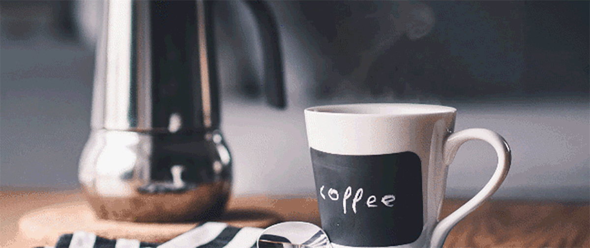

# 
PROJETO CAFETERIA

---
## OBJETIC
Desenvolver uma página web para uma Cafeteria. Nesse projeto o website receberá um estilo Efeito Parallax sendo aplicado em todas as imagens, terá um botão de "scroll/ retornar ao topo"  na parte inferior da página para o usuário acionar criará e ter uma experiência de ilusão de profundidade nas imagens dando uma impressão que o site possui mais de uma dimensão. Além disto o  usuário conseguirá interagir com as sessões da página ao clicar nos link's do topo, sendo direcionado para imagens e bem como para página externa acessando o google maps. 

cd

        Implementar uma lista na página;
        Inserir navegação na própria página do projeto;
        Inserir uma página externa ao website do projeto;
        Utilização de propriedades CSS:
        background;
        position;
        top;
        right;
        bottom;
        left;
        Deixar o topo fixo na parte superior da página;
        Posicionar o link do rodapé de forma que ele fique "flutuando";
Aplicar o efeito parallax nas imagens de fundo da página;

## ARQUITECT

## CRÉDITOS IMAGENS

https://br.freepik.com/fotos-vetores-gratis/cafeeiro

<a href="https://br.freepik.com/fotos-gratis/grao-de-cafe-em-saco-na-mesa-de-madeira-contra-grunge-verde-borrao-de-fundo_1151006.htm#query=cafeeiro&position=4&from_view=keyword&track=sph">Imagem de jigsawstocker</a> no Freepik

## Contato:

<widht></widht>  

 

 <left>  </left>